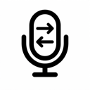
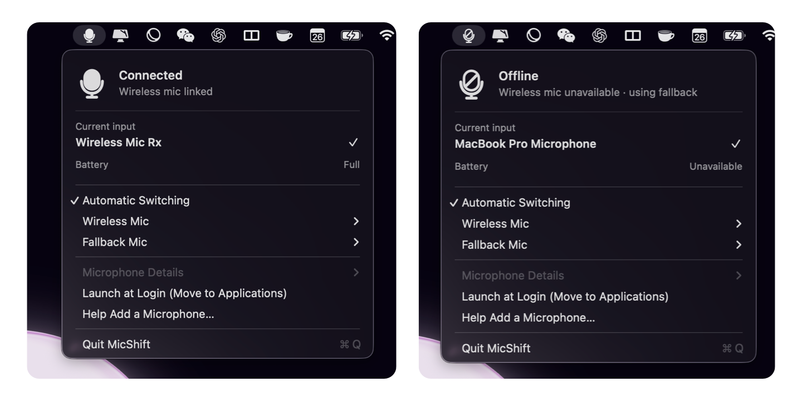

<p align="center">
  
</p>

# MicShift

**The right microphone. Automatically.**

MicShift is a free, open-source macOS menu-bar utility for wireless microphones
whose receiver stays connected after the transmitter goes offline. Put the mic
in its case, power it off, let its battery die, or lose the wireless link and
MicShift moves macOS to your fallback microphone. When the mic returns, it
switches back automatically.

<p align="center">
  
</p>

## Supported hardware

Protocol-backed switching is currently verified for:

- **DJI Mic Mini**
- **DJI Mic Mini 2**

They share the same USB receiver identity and Mic Mini protocol family. Other
DJI families—including DJI Mic 2 and DJI Mic 3—are not yet claimed as supported.
They require separate protocol decoding and real-device transition testing.

## Install

1. [Download the latest release](https://github.com/dvnkshl/MicShift/releases/latest).
2. Open the DMG and drag **MicShift** to **Applications**.
3. Launch MicShift and choose your wireless receiver under **Wireless Mic**.
4. Choose the Mac or USB microphone to use under **Fallback Mic**.
5. Enable **Launch at Login** if you want MicShift available after every login.

Set dictation and recording apps to **System Default**, **Default**, or
**Same as System**. Apps pinned to a specific input do not follow macOS default
input changes.

> GitHub Release DMGs are signed, notarized, and stapled for Gatekeeper. The
> current prebuilt release is for Apple Silicon Macs.

## What it does

- Detects a physically linked transmitter from the receiver's USB status
  protocol—never from audio silence.
- Selects the wireless receiver only while at least one transmitter is usable.
- Falls back when the transmitter is cased, powered off, empty, or out of range.
- Reconnects automatically when a usable transmitter returns.
- Shows connected/offline state and a battery band in the menu bar.
- Supports an explicitly selected receiver even when its Core Audio name is
  generic, such as `Wireless Mic Rx`.
- Runs locally without microphone permission, audio recording, telemetry, or a
  network connection.

With two transmitters, the wireless receiver remains selected while either one
is usable. The icon displays the lower battery band so it warns about the unit
that will need attention first.

## How the detection works

The bundled Rust helper reads the receiver's vendor-specific USB interface and
decodes periodic status packets using the open-source DJI Mic Control protocol
implementation.

On the current v2 Mic Mini protocol:

- status packets arrive at roughly 10 Hz;
- packet byte 44 is the physical-transmitter link mask (`0x01` TX1, `0x02` TX2);
- each connected transmitter has a 32-byte status slot;
- slot byte `+7`, bit `0x02`, reports docked/charging state;
- slot byte `+7`, bits `0x1c`, encode the battery gauge.

Audio level is decoded for diagnostics but deliberately not used as the
availability gate. A muted user or quiet room must never cause a fallback.

MicShift listens for native USB hot-plug and Core Audio device/default-input
notifications instead of continuously rescanning hardware. A slow 30-second
watchdog remains for recovery if macOS misses an event, while inaccessible
receivers retry every two seconds. Status packets that only change the live
audio-level meter do not trigger device enumeration or redraw the menu.

Read [DJI_USB_CAPABILITIES.md](DJI_USB_CAPABILITIES.md) for the complete decoded
state and [RESEARCH.md](RESEARCH.md) for the original protocol investigation.

## Build from source

Requirements:

- macOS 13 or later
- Xcode command-line tools
- stable Rust from [rustup](https://rustup.rs)

```sh
git clone https://github.com/dvnkshl/MicShift.git
cd MicShift
rustup component add rustfmt clippy
./Scripts/check.sh
./Scripts/build-app.sh
open "build/MicShift.app"
```

The local app is ad-hoc signed. Move it to `/Applications` before testing
**Launch at Login**. The current prebuilt release target is Apple Silicon; the
source itself is not intentionally architecture-specific.

If Rust is installed in an isolated directory containing `cargo/` and
`rustup/`, pass that directory as `RUST_TOOLCHAIN_DIR`.

## Release a signed DMG

`Scripts/build-release.sh` builds the helper and app, enables Hardened Runtime,
creates the DMG, submits it for notarization, staples the result, and performs
signature checks.

```sh
export DEVELOPER_ID_APPLICATION='Developer ID Application: Your Name (TEAMID)'
export NOTARYTOOL_PROFILE='micshift-notary'
./Scripts/build-release.sh
```

See [RELEASE_CHECKLIST.md](RELEASE_CHECKLIST.md) for certificate setup and the
clean-Mac acceptance test. The script refuses to overwrite an existing DMG.
Release history is recorded in [CHANGELOG.md](CHANGELOG.md).

## Help add another microphone

Choose **Help Add a Microphone…** in MicShift to create a privacy-redacted USB
report for an unsupported receiver. The discovery workflow:

1. finds composite USB audio devices with a vendor-control interface;
2. reads only a vendor-specific Bulk/Interrupt IN endpoint;
3. never opens the USB audio endpoint or sends a USB command;
4. lets the contributor mark linked, cased, powered-off, link-lost, and
   reconnected states;
5. exports a reviewable JSON report for a GitHub issue.

Discovery does not automatically mark a receiver as supported. Link, charging,
battery, power-off, range-loss, and reconnection transitions must be decoded
and reproduced on real hardware first. Read
[PROTOCOL_DISCOVERY.md](PROTOCOL_DISCOVERY.md) and
[CONTRIBUTING.md](CONTRIBUTING.md) before sharing a report.

## Limitations

- MicShift changes the Core Audio **default input**. A normal app cannot hide or
  disable another driver's physical USB device.
- Apps with a fixed input selection can ignore the system default.
- An app that already opened an audio stream may not switch until its next
  recording session.
- DJI Mic Control and MicShift cannot own the receiver's vendor USB interface at
  the same time. Quit DJI Mic Control before using MicShift.
- v1 Mic Mini firmware exposes link state, but its charging bit is not yet
  decoded. Update to v2 firmware for immediate charging-case detection.
- Charging state can disappear once a transmitter is fully charged in its case.
  MicShift correctly treats the absent transmitter as offline, but cannot
  distinguish “fully charged in case” from powered off or link lost from that
  packet alone.

## Privacy

MicShift does not request microphone permission, record audio, send telemetry,
or contact a server. Optional protocol discovery creates a local report for the
user to review. USB serial descriptors are omitted and long printable packet
fields are redacted, but unknown binary fields may still contain identifiers.

See [SECURITY.md](SECURITY.md) for private vulnerability reporting.

## License and attribution

MicShift's original code is released under the [MIT License](LICENSE).

The vendored DJI Mic Control protocol/device code is release 1.1.0 at commit
`9ba76880807a71d4eaba74c785dbee186a98f43b` and is released under the Unlicense.
See [THIRD_PARTY_NOTICES.md](THIRD_PARTY_NOTICES.md) and the vendored
[PROTOCOL.md](Vendor/dji-mic-control/PROTOCOL.md).

MicShift is an independent open-source project and is not affiliated with or
endorsed by DJI.
